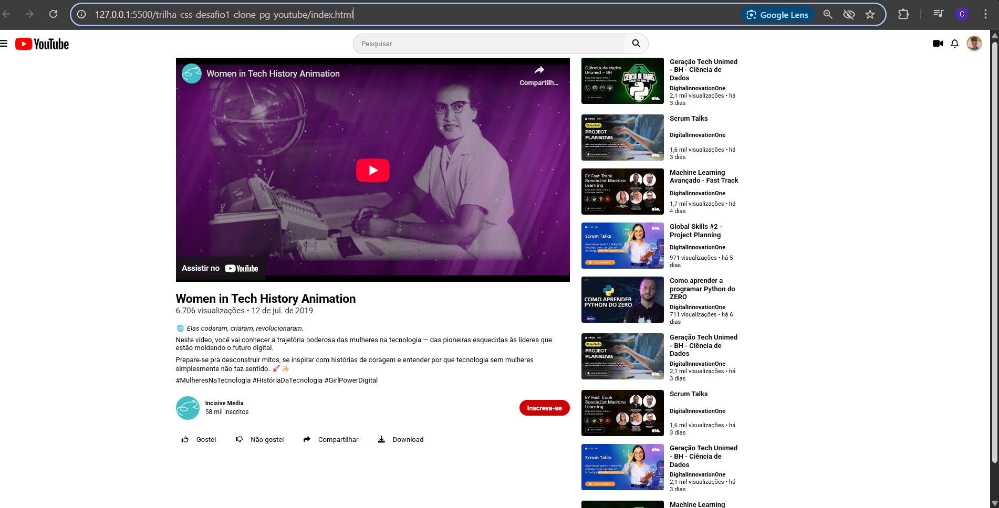

# 🎥 Desafio CSS - Clone da Página do YouTube

Projeto desenvolvido como parte do Bootcamp da DIO 🚀

## 📌 Objetivo

Reproduzir a interface de visualização de vídeos do YouTube usando apenas HTML e CSS. O foco foi aplicar Flexbox, posicionamentos e boas práticas de responsividade.

## 💻 Tecnologias

- HTML5
- CSS3 (Flexbox, media queries)
- Font Awesome

## 🖼️ Layout Base

O layout foi inspirado no modelo proposto no Figma pela DIO. 

## PERSONALIZAÇÃO
- Optei por adicionar o link do vídeo ao invés de imagem com uso de iframe
- Vídeo: Women in Tech History Animation

## 📸 Preview

## 🏁 Resultado

Projeto finalizado e hospedado com sucesso no GitHub! 🔥
