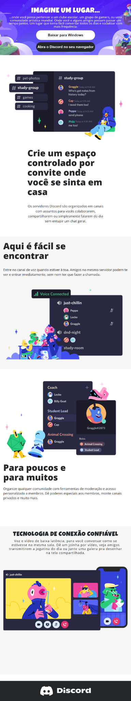

# 🎨 Projeto: Página Responsiva do Discord

Este projeto foi desenvolvido como parte de um desafio de responsividade do Bootcamp Frontend DIO, onde a missão era replicar uma página do Discord utilizando **HTML5** e **CSS3** responsivo para media queries.

## 💡 Objetivo

Construir uma ** pagina responsiva**, com base no layout fornecido via **Figma**, com foco em responsividade para telas menores (mobile first).
---

🔗 **Layout original no Figma:**  
[Desafio Responsividade — DIO](https://www.figma.com/design/NRBYrG5d4DSzObv7dpTqoM/Desafio-Responsividade---DIO?node-id=1-56&t=DYqwRfBakufdzeuA-0)

## 🚧 Desafios Enfrentados

### 1. 📏 Fidelidade ao Figma  
O primeiro obstáculo foi conciliar os tamanhos e posições definidos no Figma.

### 2. 🎯 Centralização de Conteúdo  
Alinhar elementos horizontal e verticalmente em cada section foi um exercício avançado, optei por utilizar `flexbox`.

### 3. 🎭 Layout com Camadas  
O `header` exigiu uso de **`position: absolute`** para sobrepor corretamente o conteúdo sobre o background. E claro, lidar com o `background-size: cover` pra que tudo fluísse visualmente.

### 4. 🧩 Ordem dos elementos nas sections  
Nem tudo no Figma era intuitivo: o layout visual dizia uma coisa, mas a árvore de camadas dizia outra. O desafio aqui foi conciliar o *design mental* com a hierarquia correta no HTML.

### 5. 📱 Responsividade Real  
Foi muito desafiador adaptar os elementos para mobile. Isso exigiu `media queries` bem ajustadas e reorganização do layout em colunas. Acredito ter chegado próximo ao resultado final.

---

## 🛠️ Tecnologias Usadas

- HTML5  
- CSS3  
- Google Fonts (`Luckiest Guy`, `Open Sans`)  
- Figma (para análise de layout)  
- VS Code  

---

## 📸 Preview do projeto



---

## 📂 Como executar

```bash
git clone https://github.com/seu-usuario/nome-do-projeto.git

 - Feito com muita paciência, CTRL+Z e aquele cafézinho básico ☕. 


